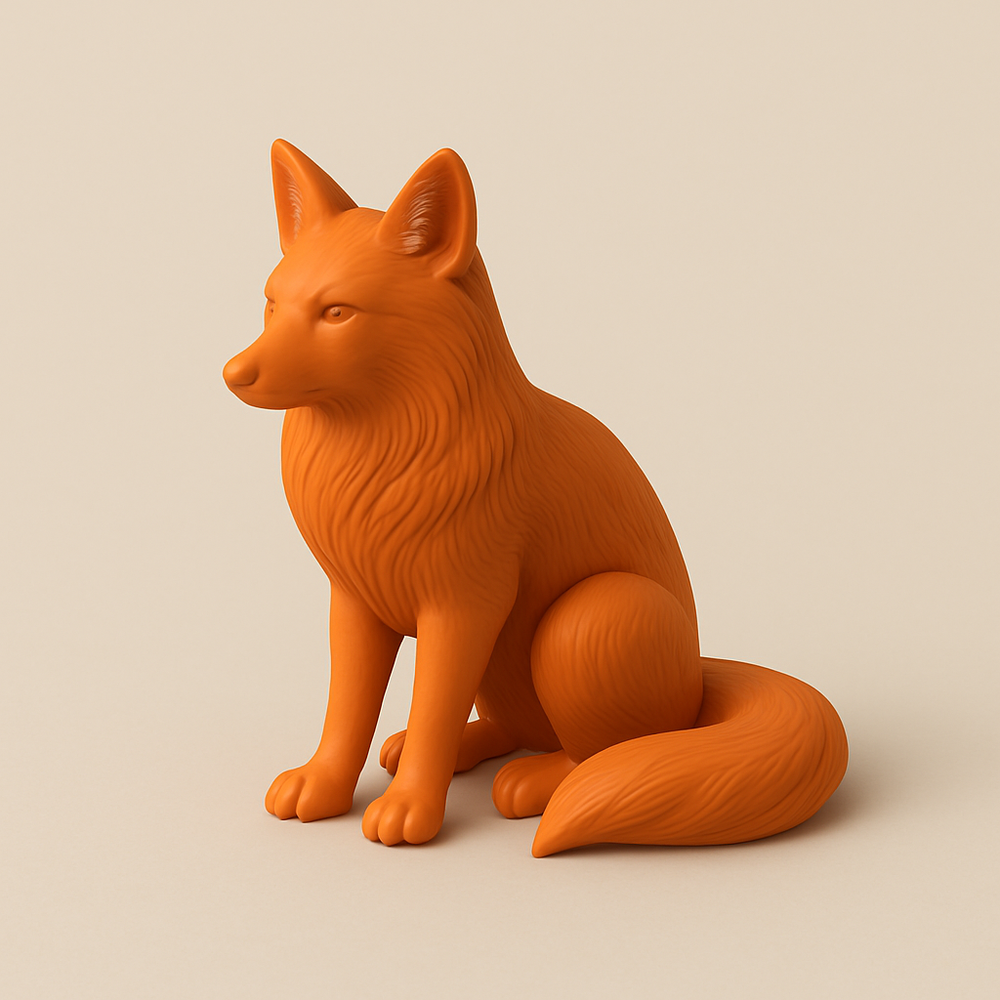
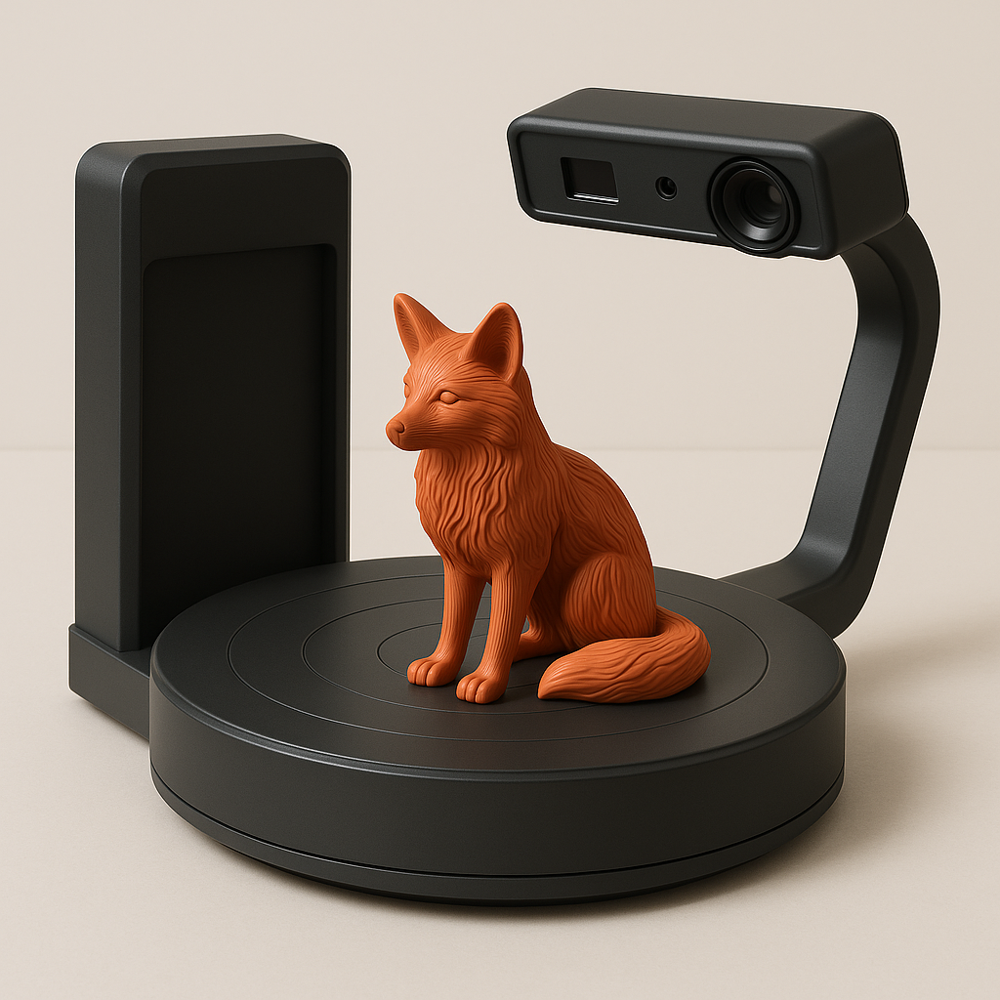
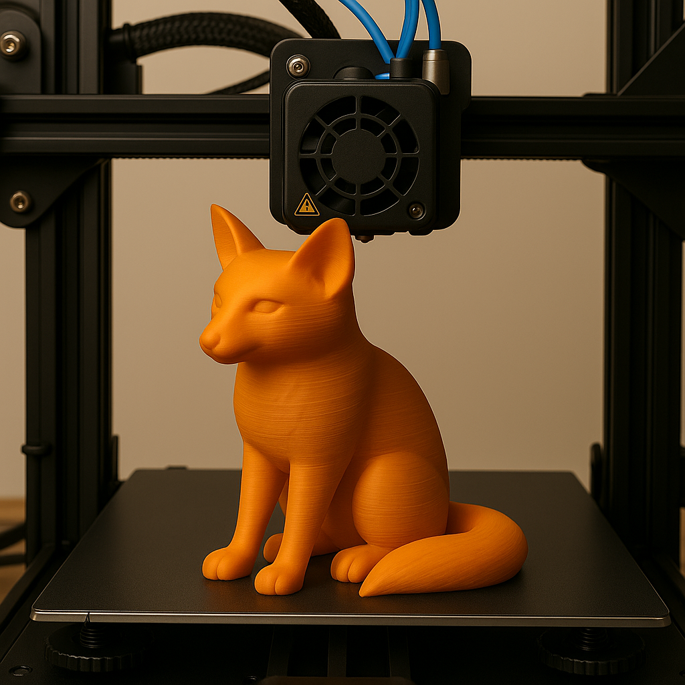
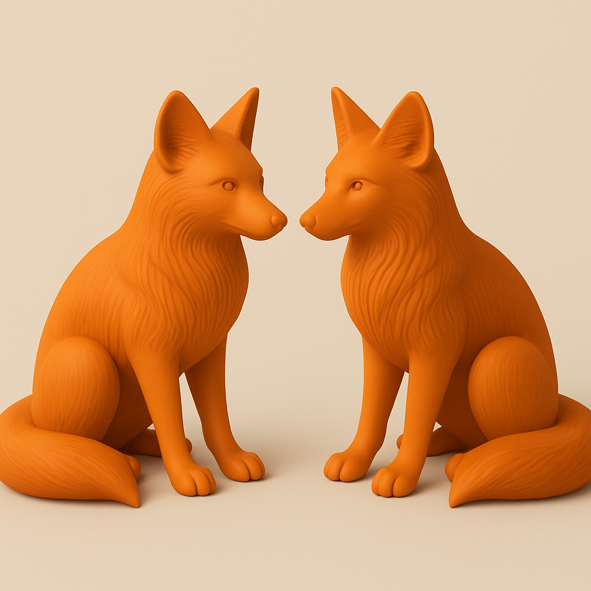

<!-- saved from url=(0056)https://designmodo.com/startup/app/preview.php?id=37408# -->
<html lang="en"><head><meta http-equiv="Content-Type" content="text/html; charset=UTF-8">
		
		<title>Startup preview - Main page</title>
		<meta name="viewport" content="width=device-width, initial-scale=1">
		<meta name="custom" content="MzEwNDM3" id="snextras">
		<link rel="icon" href="https://designmodo.com/startup/app/i/favicon-default.png">
		<!-- AOS 3.0.0-beta.6 plugin CSS (Animations) -->
		<link rel="stylesheet" href="assets/aos.css">
		<!-- Google Fonts -->
		<link href="assets/css2" rel="stylesheet" id="sf-google-fonts">
		<!-- Startup CSS + Bootstrap CSS (Styles for all blocks) - Remove ".min" if you want to edit a css code -->
		<link href="assets/styles.min.css" rel="stylesheet" id="sf-custom-css">
		<!-- jQuery 3.6.0 (uncomment line below if you need jQuery) -->
		<!--  -->
		<!-- Styles for controls (delete, move, edit, block name) -->
		<link href="assets/preview.css" rel="stylesheet">
		<!-- Open graph settings (social networks sharing settings) -->
		<meta name="twitter:card" content="summary_large_image">
		<!-- Open graph settings end -->
	</head> 
	<body data-aos-easing="ease-out-cubic" data-aos-duration="500" data-aos-delay="0">
<!-- Header 2 -->
	<header class="py-20 bg-bg-3 text-center">
		

			<h2 class="display-3 mb-4 mb-xl-6 aos-init aos-animate" data-aos="fade-down" data-aos-delay="0">3D копія = 3D скан + 3D друк</h2>
			
надрукуємо деталь із пластику і надішлемо поштою

		

	</header>
	<!-- Content 4 -->
		<section class="py-10 py-lg-20 text-center bg-bg-3">
			<a href="https://designmodo.com/startup/app/preview.php?id=37408#" class="btn btn-action-1 btn-lg">Дізнатись подробиці</a>
			

				<svg width="60" height="60" viewBox="0 0 60 60" fill="none" xmlns="http://www.w3.org/2000/svg" class="mb-4 d-inline-block fill-action-1 aos-init aos-animate" data-aos="fade-down" data-aos-delay="0">
					<path fill-rule="evenodd" clip-rule="evenodd" d="M11.9545 30L0.989454 35.8463C0.689932 36.0063 0.439497 36.2447 0.264886 36.5359C0.0902758 36.8272 -0.00195312 37.1604 -0.00195312 37.5C-0.00195313 37.8396 0.0902758 38.1728 0.264886 38.4641C0.439497 38.7553 0.689932 38.9937 0.989454 39.1537L29.1145 54.1537C29.3857 54.2982 29.6884 54.3738 29.9957 54.3738C30.303 54.3738 30.6057 54.2982 30.877 54.1537L59.002 39.1537C59.3015 38.9937 59.5519 38.7553 59.7265 38.4641C59.9011 38.1728 59.9934 37.8396 59.9934 37.5C59.9934 37.1604 59.9011 36.8272 59.7265 36.5359C59.5519 36.2447 59.3015 36.0063 59.002 35.8463L48.0482 30L44.062 32.1263L54.142 37.5L29.9995 50.3737L5.85695 37.5L15.937 32.1263L11.9507 30H11.9545Z">
					</path>
					<path fill-rule="evenodd" clip-rule="evenodd" d="M29.1184 5.845C29.3896 5.70055 29.6923 5.625 29.9996 5.625C30.307 5.625 30.6096 5.70055 30.8809 5.845L59.0059 20.845C59.3054 21.005 59.5558 21.2434 59.7304 21.5347C59.905 21.8259 59.9973 22.1592 59.9973 22.4988C59.9973 22.8383 59.905 23.1716 59.7304 23.4628C59.5558 23.7541 59.3054 23.9925 59.0059 24.1525L30.8809 39.1525C30.6096 39.297 30.307 39.3725 29.9996 39.3725C29.6923 39.3725 29.3896 39.297 29.1184 39.1525L0.99336 24.1525C0.693839 23.9925 0.443403 23.7541 0.268792 23.4628C0.094182 23.1716 0.00195312 22.8383 0.00195312 22.4988C0.00195312 22.1592 0.094182 21.8259 0.268792 21.5347C0.443403 21.2434 0.693839 21.005 0.99336 20.845L29.1184 5.845ZM5.86086 22.4988L29.9996 35.3725L54.1421 22.4988L29.9996 9.625L5.85711 22.4988H5.86086Z">
					</path>
				</svg>
			

			

				

					

						Коли у Вас є один предмет
					

					
				

				

				

				

					

						+ наш 3D сканер
					

					
				

				

				

				

					

						+ наш 3D принтер
					

					
				

				

				

				

					

						У Вас є два однакових предмети
					

					
				

			

		</section>
		<!-- Footer 2 -->
			<footer class="bg-bg-3 py-8 text-center">
				

					

						

							
						

						

							<a href="https://designmodo.com/startup/app/preview.php?id=37408#" class="font-heading text-dark-1 mx-4">Додому</a>
							<a href="https://designmodo.com/startup/app/preview.php?id=37408#" class="font-heading text-dark-1 mx-4">Як це працює</a>
							<a href="https://designmodo.com/startup/app/preview.php?id=37408#" class="font-heading text-dark-1 ms-4">Контакти</a>
						

						

							<a href="https://designmodo.com/startup/app/preview.php?id=37408#" target="_blank"><svg width="24" height="24" viewBox="0 0 24 24" fill="none" xmlns="http://www.w3.org/2000/svg" class="fill-dark-1"><path d="M22.4591 6C21.6891 6.35 20.8591 6.58 19.9991 6.69C20.8791 6.16 21.5591 5.32 21.8791 4.31C21.0491 4.81 20.1291 5.16 19.1591 5.36C18.3691 4.5 17.2591 4 15.9991 4C13.6491 4 11.7291 5.92 11.7291 8.29C11.7291 8.63 11.7691 8.96 11.8391 9.27C8.27906 9.09 5.10906 7.38 2.99906 4.79C2.62906 5.42 2.41906 6.16 2.41906 6.94C2.41906 8.43 3.16906 9.75 4.32906 10.5C3.61906 10.5 2.95906 10.3 2.37906 10V10.03C2.37906 12.11 3.85906 13.85 5.81906 14.24C5.18979 14.4122 4.52916 14.4362 3.88906 14.31C4.16067 15.1625 4.6926 15.9084 5.41008 16.4429C6.12756 16.9775 6.99451 17.2737 7.88906 17.29C6.37269 18.4904 4.49306 19.1393 2.55906 19.13C2.21906 19.13 1.87906 19.11 1.53906 19.07C3.43906 20.29 5.69906 21 8.11906 21C15.9991 21 20.3291 14.46 20.3291 8.79C20.3291 8.6 20.3291 8.42 20.3191 8.23C21.1591 7.63 21.8791 6.87 22.4591 6Z"></path></svg></a>
							<a href="https://designmodo.com/startup/app/preview.php?id=37408#" target="_blank"><svg width="24" height="24" viewBox="0 0 24 24" fill="none" xmlns="http://www.w3.org/2000/svg" class="fill-dark-1 mx-6"><path d="M12 2.03906C6.5 2.03906 2 6.52906 2 12.0591C2 17.0591 5.66 21.2091 10.44 21.9591V14.9591H7.9V12.0591H10.44V9.84906C10.44 7.33906 11.93 5.95906 14.22 5.95906C15.31 5.95906 16.45 6.14906 16.45 6.14906V8.61906H15.19C13.95 8.61906 13.56 9.38906 13.56 10.1791V12.0591H16.34L15.89 14.9591H13.56V21.9591C15.9164 21.5869 18.0622 20.3846 19.6099 18.5691C21.1576 16.7537 22.0054 14.4447 22 12.0591C22 6.52906 17.5 2.03906 12 2.03906Z"></path></svg></a>
							<a href="https://designmodo.com/startup/app/preview.php?id=37408#" target="_blank"><svg width="24" height="24" viewBox="0 0 24 24" fill="none" xmlns="http://www.w3.org/2000/svg" class="fill-dark-1"><path d="M7.8 2H16.2C19.4 2 22 4.6 22 7.8V16.2C22 17.7383 21.3889 19.2135 20.3012 20.3012C19.2135 21.3889 17.7383 22 16.2 22H7.8C4.6 22 2 19.4 2 16.2V7.8C2 6.26174 2.61107 4.78649 3.69878 3.69878C4.78649 2.61107 6.26174 2 7.8 2ZM7.6 4C6.64522 4 5.72955 4.37928 5.05442 5.05442C4.37928 5.72955 4 6.64522 4 7.6V16.4C4 18.39 5.61 20 7.6 20H16.4C17.3548 20 18.2705 19.6207 18.9456 18.9456C19.6207 18.2705 20 17.3548 20 16.4V7.6C20 5.61 18.39 4 16.4 4H7.6ZM17.25 5.5C17.5815 5.5 17.8995 5.6317 18.1339 5.86612C18.3683 6.10054 18.5 6.41848 18.5 6.75C18.5 7.08152 18.3683 7.39946 18.1339 7.63388C17.8995 7.8683 17.5815 8 17.25 8C16.9185 8 16.6005 7.8683 16.3661 7.63388C16.1317 7.39946 16 7.08152 16 6.75C16 6.41848 16.1317 6.10054 16.3661 5.86612C16.6005 5.6317 16.9185 5.5 17.25 5.5ZM12 7C13.3261 7 14.5979 7.52678 15.5355 8.46447C16.4732 9.40215 17 10.6739 17 12C17 13.3261 16.4732 14.5979 15.5355 15.5355C14.5979 16.4732 13.3261 17 12 17C10.6739 17 9.40215 16.4732 8.46447 15.5355C7.52678 14.5979 7 13.3261 7 12C7 10.6739 7.52678 9.40215 8.46447 8.46447C9.40215 7.52678 10.6739 7 12 7ZM12 9C11.2044 9 10.4413 9.31607 9.87868 9.87868C9.31607 10.4413 9 11.2044 9 12C9 12.7956 9.31607 13.5587 9.87868 14.1213C10.4413 14.6839 11.2044 15 12 15C12.7956 15 13.5587 14.6839 14.1213 14.1213C14.6839 13.5587 15 12.7956 15 12C15 11.2044 14.6839 10.4413 14.1213 9.87868C13.5587 9.31607 12.7956 9 12 9Z"></path></svg></a>
						

					

					

					

					
Copyright © 2025 3dcopy.space

				

			</footer>
	<i class="br-emoji visually-hidden" data-emoji="gesture"></i>
		<!-- Bootstrap JS -->
		

		<!-- AOS 3.0.0-beta.6 plugin JS (Animations) -->
		
		<!-- Startup Plugins -->		
		
		<!-- Startup JS (Custom js for all blocks) - Remove ".min" if you want to edit a JS code -->
		

		<!-- Startup scripts runner (for preview only, this code won't be added in the export) -->
		
	
</body></html>